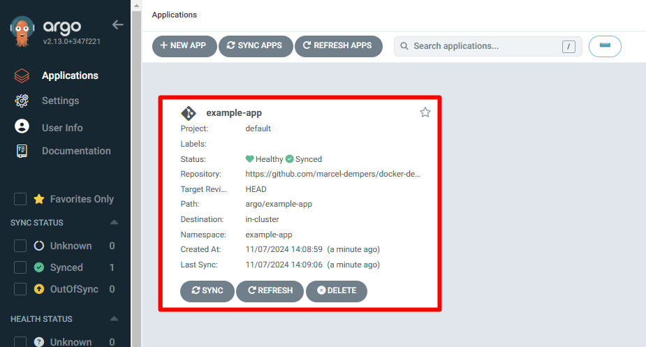
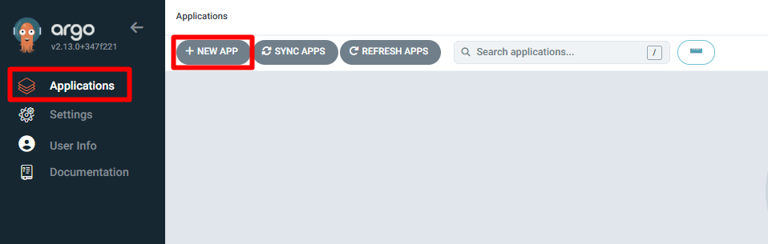
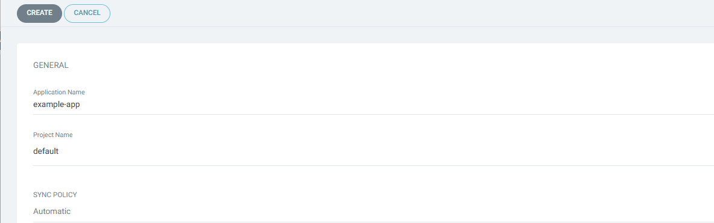
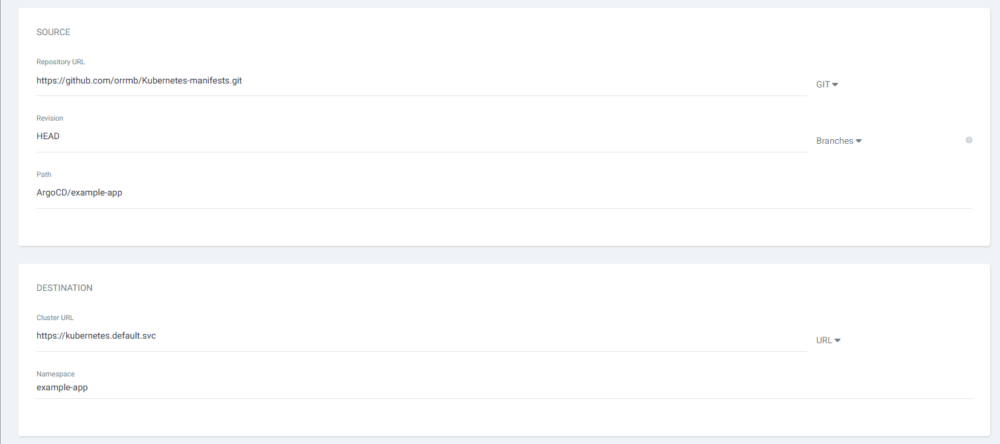
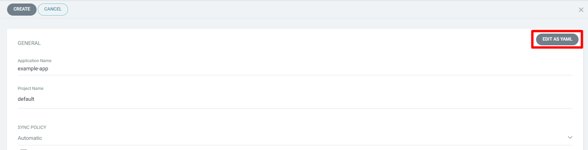
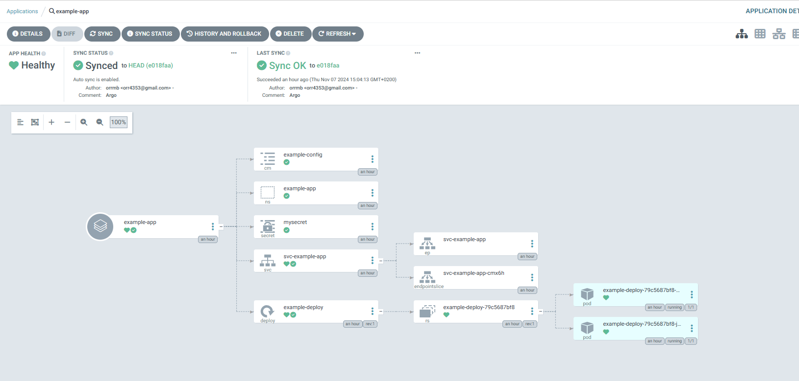
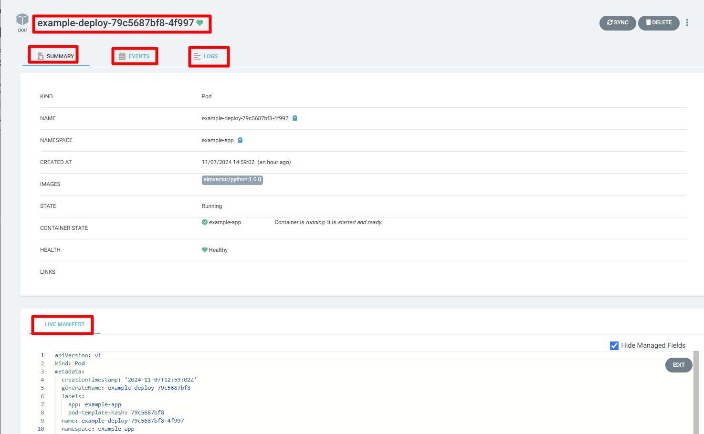
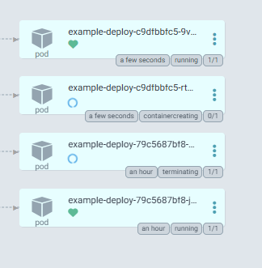
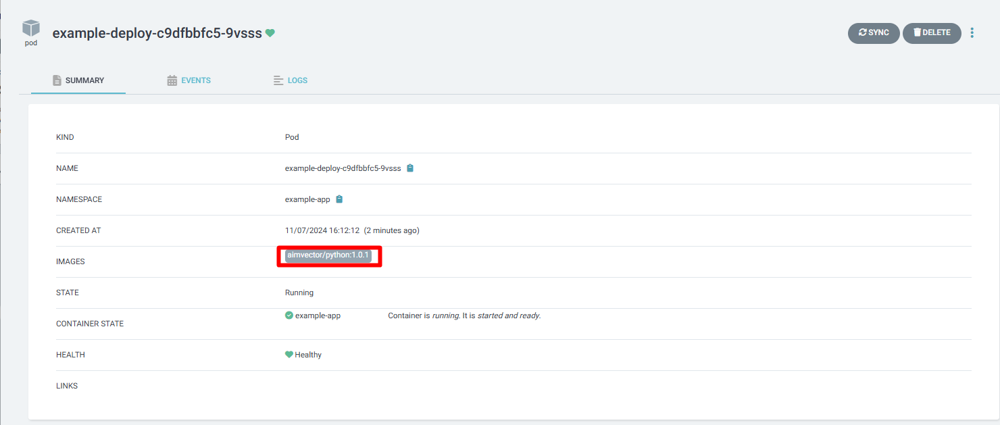

## Install ArgoCD

First, let's install ArgoCD in the our Kubernetes Cluster.

```
kubectl create namespace argocd
kubectl apply -n argocd -f https://raw.githubusercontent.com/argoproj/argo-cd/stable/manifests/install.yaml

```

```bash
Linux@Kubernetes# kubectl get namespaces
NAME              STATUS   AGE
argocd            Active   12s
default           Active   47h
kube-node-lease   Active   47h
kube-public       Active   47h
kube-system       Active   47h
```

The pods run:

```bash
Linux@Kubernetes# kubectl get pods -n argocd
NAME                                               READY   STATUS    RESTARTS   AGE
argocd-application-controller-0                    1/1     Running   0          3m26s
argocd-applicationset-controller-7d7c89f5f-4f2qf   1/1     Running   0          3m26s
argocd-dex-server-77b75c4cff-87jl5                 1/1     Running   0          3m26s
argocd-notifications-controller-64775dbfc4-c6chx   1/1     Running   0          3m26s
argocd-redis-7d85c5d7b8-nqbk6                      1/1     Running   0          3m26s
argocd-repo-server-75bf446df7-hn2vm                1/1     Running   0          3m26s
argocd-server-7bb58d96d7-9qf6b                     1/1     Running   0          3m26s

```

Access to Argo dashboard:

```bash
kubectl port-forward svc/argocd-server -n argocd 8080:443

```

The username is admin and the secret we need to get from the secrets:

```bash
Linux@Kubernetes# kubectl get secrets -n argocd argocd-initial-admin-secret -o jsonpath='{.data.password}' | base64 --decode

```


There are two way we can create app in the ArgoCD:

1.  With yaml file-

    For example:

    ```yaml
    apiVersion: argoproj.io/v1alpha1
    kind: Application
    metadata:
    name: example-app
    namespace: argocd
    spec:
    project: default
    source:
    repoURL: https://github.com/marcel-dempers/docker-development-youtube-series.git
    targetRevision: HEAD
    path: argo/example-app
    directory:
    recurse: true
    destination:
    server: https://kubernetes.default.svc
    namespace: example-app
    syncPolicy:
    automated:
    prune: false
    selfHeal: false
    ```

    Create app for ArgoCD:

    ```bash
        Linux@Kubernetes# kubectl -n argocd apply -f app.yaml

        application.argoproj.io/example-app created
    ```

    After why apply the Yaml, the app create for us in ArgoCD:

    

    <br>

2.  Manualy-

    1. In ArgoCD dashboard click _Application_
    2. click _NEW APP_
    3. Enter the Application Name,Project Name, SYNC Policy(e.g Automatic), Your Repo URL, Some Cluster, Namespace and more...
    4. We can edit with yaml this parameters

    
    
    
    

    5. After we done, click on create button.

After Argo Sync with our repo, he wil Deploy us the app and create the resource according to the yaml files in the repo.


```bash
 Linux@Kubernetes# kubectl get all -n example-app
NAME                                  READY   STATUS    RESTARTS   AGE
pod/example-deploy-79c5687bf8-4f997   1/1     Running   0          53m
pod/example-deploy-79c5687bf8-jmkvr   1/1     Running   0          53m

NAME                      TYPE           CLUSTER-IP      EXTERNAL-IP   PORT(S)        AGE
service/svc-example-app   LoadBalancer   10.110.112.14   localhost     80:32335/TCP   48m

NAME                             READY   UP-TO-DATE   AVAILABLE   AGE
deployment.apps/example-deploy   2/2     2            2           53m

NAME                                        DESIRED   CURRENT   READY   AGE
replicaset.apps/example-deploy-79c5687bf8   2         2         2       53m
```

ArgoCD give us monitoring option, we can see the logs from resources, see thiers yaml file and more..

For example, data of one of the pods in the cluster:


Let's change the image that the pod run with from aimvector/python:1.0.1 to aimvector/python:1.0.1 and what happend.

ArgoCD Deploy for us new pods, this pods run the new image we change in the yaml file



The stats of one of the new pods:


New image new pods.

After the Update, the old image pods will terminated.
